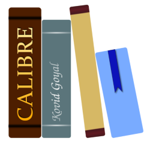
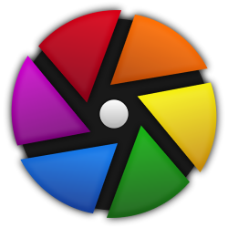
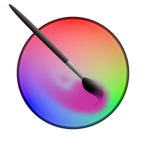
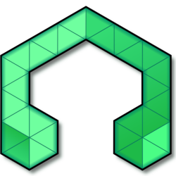
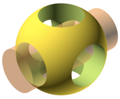
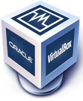
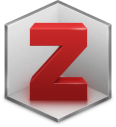

# NowDeploy Application List
The following table shows the applications that are available through NowDeploy:

#|Icon|Application Name|Publisher
-|-|-|-
1|{: style="height:50px;width:50px"}|7-Zip|Igor Pavlov
2|{: style="height:50px;width:50px"}|Calibre|Kovid Goyal
3|{: style="height:50px;width:50px"}|Chrome|Google
4|{: style="height:50px;width:50px"}|darktable|the darktable project
5|{: style="height:50px;width:50px"}|Evernote|Evernote
6|{: style="height:50px;width:50px"}|Everything|Voidtools
7|{: style="height:50px;width:50px"}|Firefox|Mozilla
8|{: style="height:50px;width:50px"}|GIMP|Don Ho
9|{: style="height:50px;width:50px"}|Git for Windows|The Git Deployment Team
10|{: style="height:50px;width:50px"}|HandBrake|The HandBrake Team
11|{: style="height:50px;width:50px"}|Horizon View|VMWare
12|{: style="height:50px;width:50px"}|Inkscape|The Inkscape Project
13|{: style="height:50px;width:50px"}|Kindle|Amazon
14|{: style="height:50px;width:50px"}|Krita|Krita Foundation
15|{: style="height:50px;width:50px"}|LMMS|LMMS Developers
16|{: style="height:50px;width:50px"}|Notepad++|Notepad++ Team
17|{: style="height:50px;width:50px"}|OBS Studio|OBS Project
18|{: style="height:50px;width:50px"}|OpenSCAD|The OpenSCAD Developers
19|{: style="height:50px;width:50px"}|PuTTY|The PuTTY Team
20|{: style="height:50px;width:50px"}|Python3|Python Software Foundation
21|{: style="height:50px;width:50px"}|RingCentral Meetings|RingCentral
22|{: style="height:50px;width:50px"}|R for Windows|R Core Team
23|{: style="height:50px;width:50px"}|TightVNC|GlavSoft LLC
24|{: style="height:50px;width:50px"}|TreeSize Free|JAM Software
25|{: style="height:50px;width:50px"}|VirtualBox|Oracle Corporation
26|{: style="height:50px;width:50px"}|VLC Media Player|VideoLAN Corporation
27|{: style="height:50px;width:50px"}|Wireshark|Wireshark Project
28|{: style="height:50px;width:50px"}|Zotero|CDS

