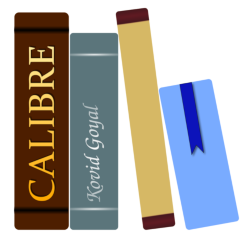
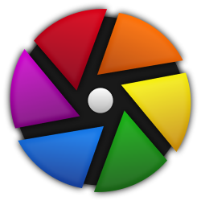
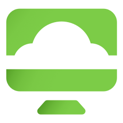
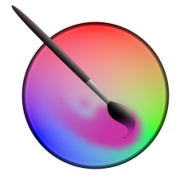
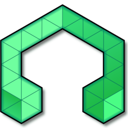
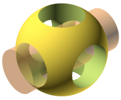
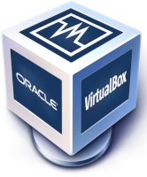
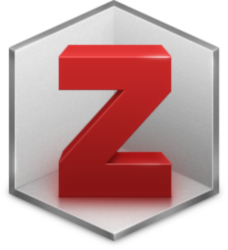

# NowDeploy Application List
The following table shows the applications that are available through NowDeploy:

#|Icon|Application|Publisher|Enterprise|Free
-|-|-|-|-|-
1|{: style="height:50px;width:50px"}|7-Zip|Igor Pavlov|X|X
2|{: style="height:50px;width:50px"}|Calibre|Kovid Goyal|X|-
3|{: style="height:50px;width:50px"}|Chrome|Google|X|-
4|{: style="height:50px;width:50px"}|darktable|the darktable project|X|-
5|{: style="height:50px;width:50px"}|Evernote|Evernote|X|-
6|{: style="height:50px;width:50px"}|Everything|Voidtools|X|X
7|{: style="height:50px;width:50px"}|Firefox|Mozilla|X|-
8|{: style="height:50px;width:50px"}|GIMP|Don Ho|X|X
9|{: style="height:50px;width:50px"}|Git for Windows|The Git Deployment Team|X|-
10|{: style="height:50px;width:50px"}|HandBrake|The HandBrake Team|X|-
11|{: style="height:50px;width:50px"}|Horizon View|VMWare|X|-
12|{: style="height:50px;width:50px"}|Inkscape|The Inkscape Project|X|-
13|{: style="height:50px;width:50px"}|Kindle|Amazon|X|-
14|{: style="height:50px;width:50px"}|Krita|Krita Foundation|X|-
15|{: style="height:50px;width:50px"}|LMMS|LMMS Developers|X|-
16|{: style="height:50px;width:50px"}|Notepad++|Notepad++ Team|X|X
17|{: style="height:50px;width:50px"}|OBS Studio|OBS Project|X|-
18|{: style="height:50px;width:50px"}|OpenSCAD|The OpenSCAD Developers|X|-
19|{: style="height:50px;width:50px"}|PuTTY|The PuTTY Team|X|X
20|{: style="height:50px;width:50px"}|Python3|Python Software Foundation|X|-
21|{: style="height:50px;width:50px"}|RingCentral Meetings|RingCentral|X|-
22|{: style="height:50px;width:50px"}|R for Windows|R Core Team|X|-
23|{: style="height:50px;width:50px"}|TightVNC|GlavSoft LLC|X|-
24|{: style="height:50px;width:50px"}|TreeSize Free|JAM Software|X|-
25|{: style="height:50px;width:50px"}|VirtualBox|Oracle Corporation|X|-
26|{: style="height:50px;width:50px"}|VLC Media Player|VideoLAN Corporation|X|-
27|{: style="height:50px;width:50px"}|Wireshark|Wireshark Project|X|-
28|{: style="height:50px;width:50px"}|YubiKey Personalization Tools|Yubico|X|-
29|{: style="height:50px;width:50px"}|Zotero|CDS|X|-

